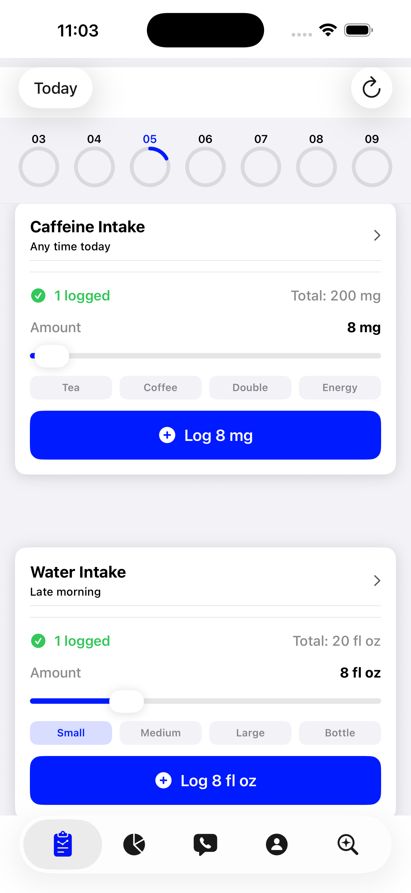
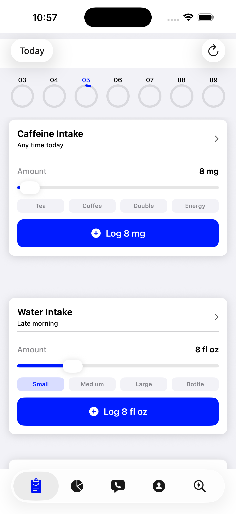
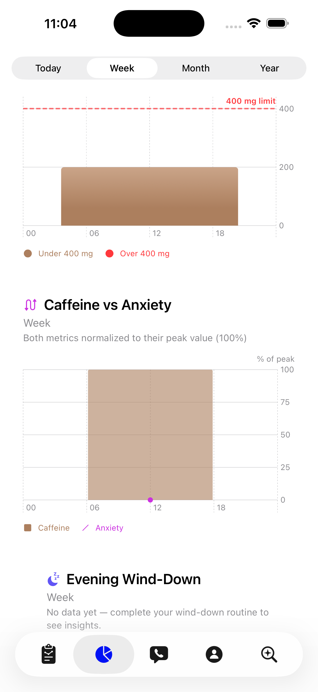
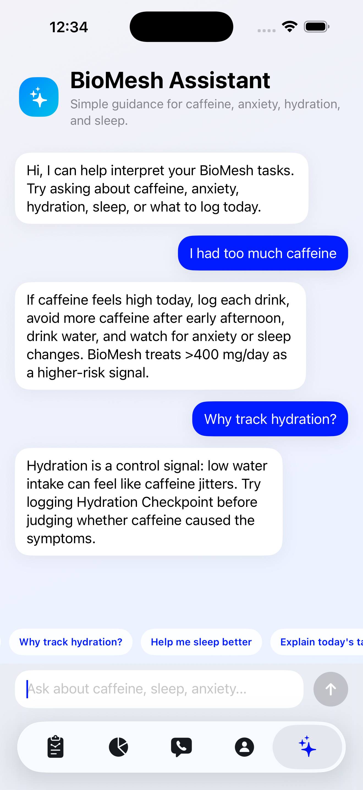

# BioMesh
     

## Description
BioMesh is a mobile health application built on [CareKit](https://github.com/carekit-apple/CareKit) that monitors caffeine consumption and its physiological impacts on sleep and anxiety. Unlike general wellness apps that track calories or steps in isolation, BioMesh focuses exclusively on the caffeine-sleep-anxiety triad, providing users with actionable, domain-specific insights into their stimulant habits. All data syncs to the cloud via [ParseCareKit](https://github.com/netreconlab/ParseCareKit) using a HIPAA-compliant [parse-hipaa](https://github.com/netreconlab/parse-hipaa) backend on Heroku.

### Demo Video
To learn more about this application, watch the video below:

### Designed for the following users
BioMesh is designed for college students, remote workers, and young professionals aged 18-35 who consume caffeine daily and have concerns about its effect on their sleep quality or stress levels. This demographic typically consumes caffeine at high frequency in uncontrolled real-world settings -- exactly the scenario that existing laboratory studies fail to capture. The app benefits users by providing daily visibility into their stimulant habits, personalized feedback on the relationship between caffeine timing and self-reported anxiety episodes, and a historical log that can be shared with a healthcare provider.

   

Developed by:
- [Junfei (Faye) Huang](https://github.com/fayehjf) - University of Southern California, Electrical and Computer Engineering
- [Alarik Damrow](https://github.com/AlarikDamrow) - University of Southern California, Electrical and Computer Engineering
- [Junhao (Ray) Zhang](https://github.com/harrison12241) - University of Southern California, Electrical and Computer Engineering

ParseCareKit synchronizes the following entities to Parse tables/classes using [Parse-Swift](https://github.com/parse-community/Parse-Swift):

- [x] OCKTask <-> Task
- [x] OCKHealthKitTask <-> HealthKitTask
- [x] OCKOutcome <-> Outcome
- [x] OCKRevisionRecord.KnowledgeVector <-> Clock
- [x] OCKPatient <-> Patient
- [x] OCKCarePlan <-> CarePlan
- [x] OCKContact <-> Contact

**Use at your own risk. There is no promise that this is HIPAA compliant and we are not responsible for any mishandling of your data**

## Features

### Care Plans (3 total)
BioMesh organizes all tasks into three `OCKCarePlan`s:
| Care Plan | Purpose |
|---|---|
| **Daily Tracking** | Caffeine intake, water intake, anxiety check-in, morning energy snapshot |
| **Sleep & Wellness** | Evening wind-down checklist, desk stretch break, hydration guide link |
| **Assessments** | Daily symptom check-in survey, weekly pattern reflection survey, onboarding, range of motion, tapping speed, caffeine research link |

### Tasks (16 total)

#### Custom OCKTasks (10)
| Task | Card Type | Schedule | Care Plan |
|---|---|---|---|
| Caffeine Intake | SliderLog | All day, daily | Daily Tracking |
| Water Intake | SliderLog | 11 AM + 4 PM, daily | Daily Tracking |
| Anxiety Check-in | Button Log | All day, every other day | Daily Tracking |
| Morning Energy Snapshot | Simple | 9 AM, daily | Daily Tracking |
| Evening Wind-Down | Custom (Checklist) | 9:30 PM, daily | Sleep & Wellness |
| Desk Stretch Break | Checklist | 3:30 PM, daily | Sleep & Wellness |
| Hydration Guide | Link | 9 AM, daily | Sleep & Wellness |
| Caffeine Research Resource | Link | 3:30 PM, daily | Assessments |
| Daily Symptom Check-In | Survey (SwiftUI) | 8 PM, daily | Assessments |
| Weekly Pattern Reflection | Survey (SwiftUI) | Sunday 6 PM, weekly | Assessments |

#### UIKit Survey Tasks (3, iOS only)
| Task | Type | Schedule |
|---|---|---|
| Onboarding | ORKOrderedTask (consent + permissions) | Daily until completed |
| Range of Motion | ORKOrderedTask (knee ROM sensor task) | Daily first week, then weekly |
| Tapping Speed | ORKOrderedTask (finger tapping active task) | Daily |

#### OCKHealthKitTasks (3)
| Task | HealthKit Quantity | Schedule |
|---|---|---|
| Steps | stepCount (cumulative) | All day, daily |
| Heart Rate | heartRate (discrete) | All day, daily |
| Resting Heart Rate | restingHeartRate (discrete) | All day, daily |

### Card Types Used (13)
1. **Button Log** -- Anxiety Check-in
2. **Checklist** -- Desk Stretch Break
3. **Custom** -- Evening Wind-Down (3-item checklist: no caffeine after 2 PM, dim lights, phone face-down)
4. **Featured** -- CustomFeaturedContentView with FDA caffeine safety link
5. **Grid** -- GridTaskCardView
6. **Instruction** -- Onboarding, Range of Motion, Tapping Speed cards
7. **LabeledValue** -- Heart Rate, Resting Heart Rate (HealthKit)
8. **Link** -- Hydration Guide (Mayo Clinic), Caffeine Research Resource (FDA)
9. **NumericProgress** -- Steps (HealthKit)
10. **Simple** -- Morning Energy Snapshot
11. **SliderLog** -- Caffeine Intake (0-500 mg), Water Intake (0-32 fl oz)
12. **Survey** -- Daily Symptom Check-In, Weekly Pattern Reflection (SwiftUI ResearchKit)
13. **UIKitSurvey** -- Onboarding, Range of Motion, Tapping Speed (UIKit ResearchKit)

### ResearchKit Integration
- **Onboarding**: Multi-step ORKOrderedTask with welcome screen, study overview, HTML consent form with signature capture (ORKWebViewStep), HealthKit permissions request (ORKRequestPermissionsStep), and completion screen. All tasks are gated behind onboarding completion.
- **Daily Symptom Check-In**: 4-question SwiftUI survey (caffeine timing, drink count, anxiety level 0-10, sleep readiness) with ORKReviewStep for answer validation before submission.
- **Weekly Pattern Reflection**: 2-question SwiftUI survey (caffeine cutoff compliance, stress manageability 0-10) with ORKReviewStep.
- **Range of Motion**: Built-in ResearchKit knee ROM active task using device accelerometer/gyroscope sensors.
- **Tapping Speed**: Built-in ResearchKit finger tapping active task measuring motor speed and alertness.
- **ORKReviewStep** (Extra Credit): All survey tasks include a review step allowing users to verify and edit answers before final submission.

### Insights Tab
The Insights tab provides four visualization components with a date interval picker (Today / Week / Month / Year):
- **Weekly Summary Card**: Displays total caffeine (mg), water intake (fl oz), anxiety episodes, and wind-down completion rate for the selected period.
- **Caffeine Intake Chart**: Bar chart showing daily caffeine consumption in mg.
- **Caffeine vs. Anxiety Chart**: Dual-axis overlay using percentage-of-peak normalization (0-100% scale). Brown bars represent caffeine intake, purple line with Catmull-Rom interpolation shows anxiety trend.
- Built with SwiftUI Charts framework.

### AI Assistant
BioMesh includes a built-in AI health assistant (developed by Junhao Zhang):
- **OpenAI Integration**: Uses GPT-5.4-mini via the `/v1/responses` endpoint with a 120-token limit and a domain-specific system prompt focused on caffeine, anxiety, hydration, sleep, and activity.
- **Rule-Based Fallback**: `BioMeshAssistantEngine` provides offline keyword-matched responses for caffeine/coffee, anxiety/stress, hydration/water, and sleep/bedtime topics when the API is unavailable.
- **Quick Reply Chips**: Pre-built prompts ("I had too much caffeine", "Why track hydration?", "Help me sleep better", "Explain today's tasks") for one-tap interaction.
- Chat interface with animated message bubbles using SwiftUI spring animations.

### watchOS Companion App (Extra Credit)
- Displays CareKit tasks on Apple Watch using `OCKDailyTasksPageViewController`.
- Syncs data between iPhone and Apple Watch via `WCSession` (WatchConnectivity framework).
- `RemoteSessionDelegate` and `LocalSessionDelegate` handle bidirectional message passing.
- Background queue dispatch for `WCSession.default.sendMessage` to avoid MainActor blocking.

### Profile & Contacts
- **Profile Tab**: Comprehensive form with About (name, birthday, sex, allergies, notes) and Contact (street, city, state, postal code, email, phone, messaging number) sections. Profile picture upload via `ParseFile` cloud storage. Data persists to Parse Patient and Contact classes.
- **Contacts Tab**: Searchable contact directory with `CNContactPickerViewController` integration for importing device contacts. User's own contact is filtered out (accessible via "My Contact" in Profile).
- **My Contact Card**: `OCKDetailedContactViewController` with Call, Message, and Email action buttons.

### Authentication
- Custom login/signup screen with email-based authentication via Parse.
- `LoginViewModel` with async `try-catch` error handling for `ParseError` codes.
- Anonymous login support for quick demo access.

### Architecture

The system uses a four-component architecture:
- **Apple Watch** communicates with iPhone via WCSession
- **iPhone** runs the CareKit app with local OCKStore
- **Parse Server (HIPAA)** provides cloud sync via ParseCareKit
- **HealthKit** provides passive health data via OCKHealthKitTask

## Final Checklist
- [x] Signup/Login screen tailored to app
- [x] Signup/Login with email address
- [x] Custom app logo
- [x] Custom styling
- [x] Add at least **5 new OCKTask/OCKHealthKitTasks** to your app
  - [x] Have a minimum of 7 OCKTask/OCKHealthKitTasks in your app (16 total)
  - [x] 3/7 of OCKTasks should have different OCKSchedules than what's in the original app
- [x] Use at least 5/7 cards below in your app
  - [x] InstructionsTaskView - used for Onboarding, Range of Motion, Tapping Speed
  - [x] SimpleTaskView - used for Morning Energy Snapshot
  - [x] Checklist - used for Desk Stretch Break
  - [x] Button Log - used for Anxiety Check-in
  - [x] GridTaskView - used for grid-layout tasks
  - [x] NumericProgressTaskView (SwiftUI) - used for Steps (HealthKit)
  - [x] LabeledValueTaskView (SwiftUI) - used for Heart Rate, Resting Heart Rate (HealthKit)
- [x] Add the LinkView (SwiftUI) card to your app
- [x] Replace the current TipView with CustomFeaturedContentView that subclasses OCKFeaturedContentView
- [x] Tailor the ResearchKit Onboarding to reflect your application
- [x] Add tailored check-in ResearchKit survey to your app
- [x] Add a new tab called "Insights" to MainTabView
- [x] Replace current ContactView with searchable contact view
- [x] Change the ProfileView to use a Form view
- [x] Add at least two OCKCarePlans and tie them to their respective OCKTasks and OCKContacts (3 care plans total)

### Extra Credit
- [x] ORKReviewStep added to all survey tasks for answer validation before submission
- [x] watchOS companion app displaying CareKit tasks via WatchConnectivity

## Wishlist Features
1. **Bidirectional iOS Contacts Sync**: Automatically update imported contacts in the app when the original iOS contact is modified, and support multiple phone numbers/emails per contact.
2. **Personalized Insights with ML**: Use on-device CoreML to detect personal caffeine sensitivity patterns and provide individualized recommendations (e.g., "Your anxiety spikes 4 hours after caffeine -- consider stopping by 1 PM").
3. **Social Accountability**: Allow users to share weekly summaries with friends or accountability partners, with opt-in leaderboards for hydration streaks and wind-down routine completion.
4. **TestFlight Deployment**: Deploy via TestFlight for real-device sensor calibration (Range of Motion, heart rate) and multi-week longitudinal data collection with a pilot cohort.
5. **CareKit Data in AI Assistant**: Feed real-time CareKit outcome data into the AI assistant so responses reference the user's actual caffeine/anxiety/sleep history rather than providing generic advice.

## Challenges Faced While Developing

### Backend Connectivity
The primary challenge was ensuring the `ParseCareKit.plist` exactly matched the Heroku environment variables. Discrepancies in the Server URL or ApplicationID caused silent synchronization failures where `isServerAvailable()` would return "health not ok."

### Asynchronous Error Handling
Implementing the `LoginViewModel` required complex `try-catch` blocks to handle `ParseError` codes. Failure to convert error types correctly resulted in runtime crashes during the signup/login flow.

### Main Thread Constraints
A recurring crash occurred when calling `WCSession.default.sendMessage` for Apple Watch connectivity. This was resolved by offloading the message dispatch to a global background queue to avoid blocking the MainActor.

### ResearchKit Platform Guards
ResearchKit is iOS-only, which caused compilation failures for the watchOS and visionOS targets. This required `#if os(iOS)` guards throughout the codebase for any ResearchKit imports or usage.

### CareKit Store Coordinator
The store type being `OCKStoreCoordinator` rather than `OCKStore` meant using protocol-level methods (`fetchAnyEvents`/`addAnyOutcome`) for onboarding gate checks and survey outcome saving, requiring careful type casting.

### Protocol Compliance in UI
Implementing `OCKAppearanceStyler` required strict adherence to type signatures (e.g., ensuring `shadowOpacity` was a `Float` and not a `Double`), which led to subtle compilation errors.

### OCKSurveyTaskViewController Unavailability
CareKit's SPM package does not list ResearchKit as a dependency, so `OCKSurveyTaskViewController` is never compiled. We built a custom `SurveyCardViewController` that subclasses `OCKInstructionsTaskViewController` and intercepts the completion tap to present ORK surveys modally.

## Setup Your Parse Server

### Heroku
The easiest way to setup your server is using the [one-button-click](https://github.com/netreconlab/parse-hipaa#heroku) deployment method for [parse-hipaa](https://github.com/netreconlab/parse-hipaa).

## View Your Data in Parse Dashboard

### Heroku
The easiest way to setup your dashboard is using the [one-button-click](https://github.com/netreconlab/parse-hipaa-dashboard#heroku) deployment method for [parse-hipaa-dashboard](https://github.com/netreconlab/parse-hipaa-dashboard).
